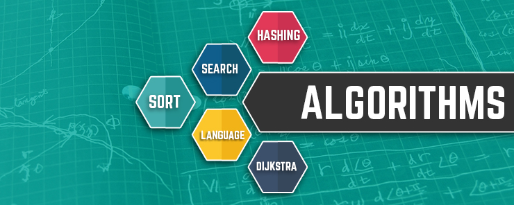

<p align="center">
  
  &nbsp;&nbsp;
  
</p>

# 📐 Cours Algorithmique — ISI

> **Formateur :** Robert | **Établissement :** ISI (Institut Supérieur d'Informatique)
> **Niveaux :** Licence 1 & Licence 2

Ce dépôt contient les supports de cours d'Algorithmique, les exercices et leurs corrigés.

---

## 📚 Plan du cours

| # | Chapitre | Lien |
|---|----------|------|
| 1 | Introduction & bases de l'algorithmique | [cours/1-Intro_&_base_Algo.md](cours/1-Intro_%26_base_Algo.md) |
| 2 | Révisions — Structures de base | [cours/revision_Algo.md](cours/revision_Algo.md) |
| 3 | Révisions — Chaînes de caractères | [cours/revision_Algo_chaine.md](cours/revision_Algo_chaine.md) |
| 4 | Les fichiers en algorithmique | [cours/Les_fichiers_algo.md](cours/Les_fichiers_algo.md) |

---

## 🏋️ Exercices

| Exercice | Description |
|----------|-------------|
| [Structures de contrôle](exercices/serie_algo_structures_controle.md) | Série sur if, while, for |
| [Tableaux & Matrices L1](exercices/serieL1_tab_mat.md) | Exercices tableaux et matrices |
| [Fichiers algorithmiques](exercices/serie1_algo_fichiers.md) | Série sur les fichiers |
| [Préparation BTS](exercices/td_algo_prepaBTS.md) | TD préparation aux concours |
| [Algo en Python](exercices/serie_algo_python.md) | Série algorithmique implémentée en Python |

---

## ✅ Corrections

| Correction | Description |
|------------|-------------|
| [Correction séries en C](corrections/corr_serie_algo_en_c.md) | Corrigé des exercices en langage C |
| [Solution série part.1](corrections/sollution_serie_part1.md) | Corrigé de la première série |

---

## 🗂️ Organisation du dépôt

```
CoursAlgo/
├── cours/          → Chapitres du cours (.md)
├── exercices/      → Séries et TDs
└── corrections/    → Corrigés
```

---

## 🔗 Autres cours

| Cours | Lien |
|-------|------|
| Python | [CoursPython](https://github.com/Robsroberto/CoursPython) |
| Langage C | [Cours_LangageC](https://github.com/Robsroberto/Cours_LangageC) |
| Bases de données | [CoursBD_SGBD](https://github.com/Robsroberto/CoursBD_SGBD) |
